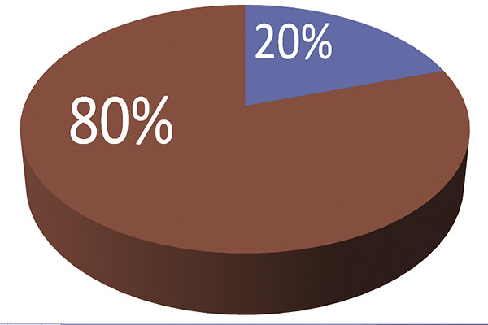

## LENGUAJE PYTHON NIVEL INICIAL Y APLICACIÓN EN DIGITALIZACIÓN DE SECTORES PRODUCTIVOS 

### CEP de Jaén

#### CC by José Antonio Vacas @javacasm

Octubre 2022

## Objetivos

* Introducir y mostrar las posibilidades del lenguaje python para digitalización de la Formación profesional en su relación con los sectores productivos.
* Conocer y trabajar con los elementos básicos del lenguaje python
* Elaborar aplicaciones simples en lenguaje python

## Descripción

Python es un lenguaje tan extenso y utilizado que un curso que pretendiera ser "completo" sería inabarcable.

Por eso en este curso vamos a tratar las características de Python que te permiten resolver el 80% de los problemas, dejando para un curso posterior, más avanzado ese 20% que nos llevaría mucho más tiempo explicar y aprender ([principio de Pareto o la regla 80-20](https://es.wikipedia.org/wiki/Principio_de_Pareto)).

Por eso decimos que el curso empieza desde cero y llega hasta un nivel intermedio, dejando el resto para un curso avanzado.

Para ello vamos a utilizar muchos ejemplos concretos para cada punto y algunos proyectos más extensos que iremos construyendo a lo largo del curso.

### Contenido / Índice

Veamos un índice detallado:

0. Introducción a Python
    * Historia 
    * Versiones 
    * Evolución
    * Usos y aplicaciones

1. Instalación y primeras pruebas
    * 1ª instalación 
    * La consola y Hello Python
    * Entornos de desarrollo

2. Primeros ejemplos
    * Nuestro código en ficheros
    * 1er programa: Hola Python
    * Normas de escritura de código en Python: formato, comentarios, ...
    * Diferencias con otros lenguajes

3. Variables, tipos y operaciones 
    * Variables
    * Manejo de números
    * Operadores aritméticos
    * Tipos
    * Conversiones entre tipos
    * Entrada de datos
    * Excepciones y errores

4. Sentencias condicionales y operadores
    * Sentencias condicionales
    * Operadores lógicos
    * Operadores relacionales

5. Bucles e iteraciones 
    * Bucle while
    * Iteración sobre listas
    * Bucle for
    * Excepciones y errores
    * Ejemplos

6. Trabajando con funciones
    * Qué es una función
    * Ejemplos de uso
    * Todo está lleno de funciones en Python...
    * Depuración en funciones
    * Variables globales y locales
    * Funciones recursivas
    * Ejemplos

7. Colecciones: Listas, tuplas y diccionarios
    * Listas
    * Tuplas
    * Diccionarios
    * Diferencias y usos de cada
    * Excepciones y errores
    * Ejemplos: 
        * Generador de jerga técnica (BuzzWords)
        * Cálculo de retenciones IRPF
        * Juego de las 20 preguntas

8. Trabajando con ficheros
    * Administración y gestión de ficheros
    * Lectura de ficheros
    * Escritura de ficheros
    * Excepciones y errores
    * Procesamiento de cadenas (strings)
    * Ejemplo: 
        * WordCounter - contador de palabras, líneas y caracteres
        * Juego de las 20 preguntas v2

9. Módulos y librerías
    * Qué es un módulo
    * Librería estándar de Python
    * Instalación de módulos
